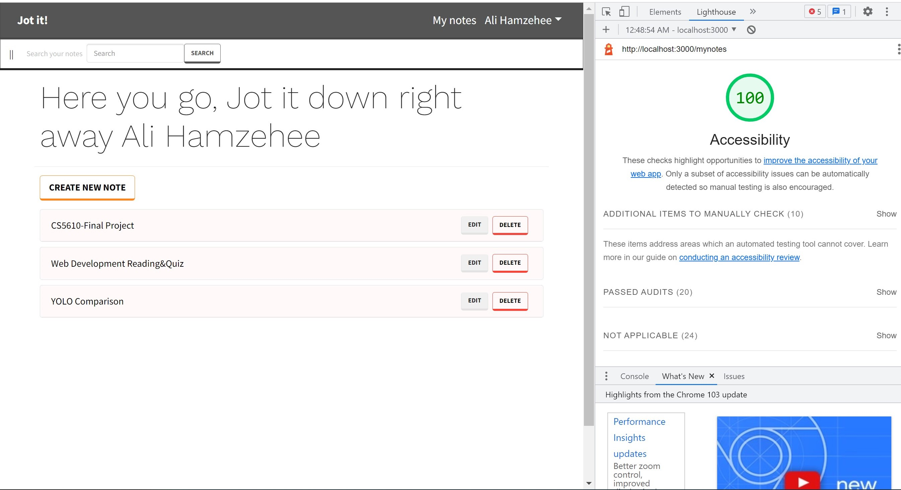
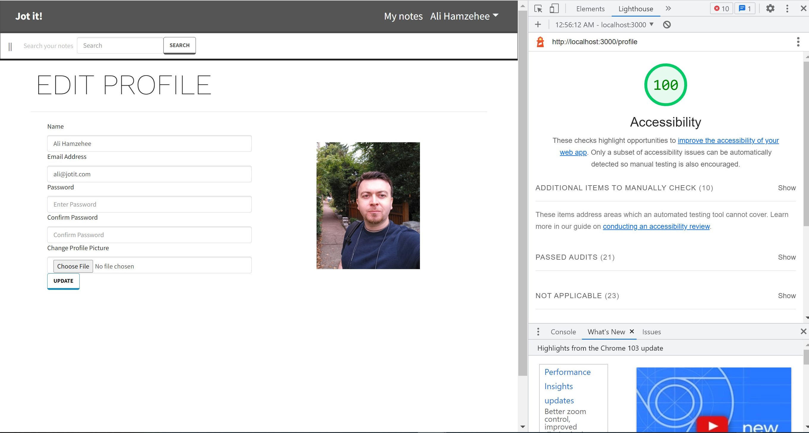
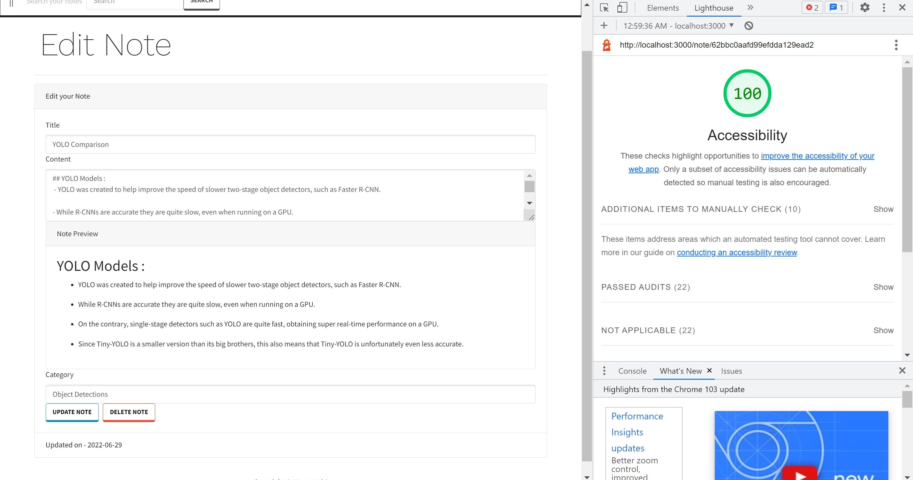

# cs5610
## Iteration 1

This Iteration is consisting of front-end, using React DOM Router, bootstrap and mongoDB and back-end using nodejs and express as you can see, 
and at the end, i installed axios and mongoose to create the connection to the DB, 
but at this step i am not fetching data from DB, as currently i am getting data from note.js file. 

### to run the front-end and back-end please use following command:

npm run dev

use following links to access the demo :

App : https://jote-it2.herokuapp.com/

Backend : https://jote-it3.herokuapp.com/

https://github.com/phoenix644/cs5610

this is the login page from the frontend:

after that if you click on my notes, you will be going to note list page(code is available : ./frontend/screens/mynotes/mynotes.js.
this page is responsive right now. 

which the notes are fetching from this path :"/api/notes" from backend .
also you can get accesss directly using following URL: https://jote-it3.herokuapp.com/api/notes

## Iteration 2

in the following of the last iteration i continue developing my web application by adding these features:
* Login/Logout
    Login page, add encryption
    add user model.
    adding JWTtoken to users.
    implement logout features.
* Register
    -register new user.
    
    
* MiddleWares 
    -Add two middle-ware to handle errors and protecting API from unauthorized access
    
    
* External WebAPI
    -implement a functionality to store and retrieve profile photos Cloudinary website.
    
* Redux
    -implementing Redux for manipulating the state in application using Redux for Login/Logout/Register features.
    
    
* CRUD
    -Implement the CRUD functionality to create update find and delete a new note(this feature has not added yet to the front end).
   

## Iteration 3

in this final Iteration my App got completed.
following features added :

* Fetching notes.

* Create notes.
* showing note using react-markdown.

* Update and delete Notes.
* Delete Notes.
* Searching.
* Profile Page.
* Update UserProfile.
* showing list of users API in back-end using : /api/users/newmember

the output of the this Iteration has shown as followings, 
also to manipulate the state i am using Redux as it has shown in screenshots.

as you can see all pages has accessibility validation with a score of 100.

